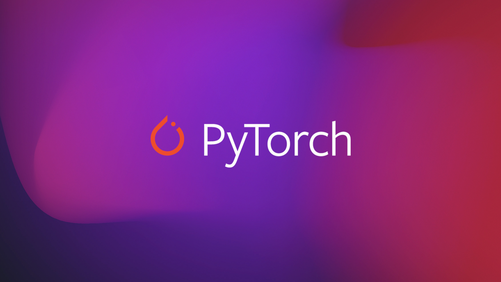

# Learning PyTorch 

PyTorch is a machine learning library for the programming language Python, based on the [Torch](https://en.wikipedia.org/wiki/Torch_(machine_learning)) library, used for applications such as deep learning and natural language processing. It is primarily developed by Facebook's artificial-intelligence research group, and Uber's [Pyro probabilistic](https://en.wikipedia.org/wiki/Probabilistic_programming) programming language software is built on it. An open source deep learning platform that provides a seamless path from research prototyping to production deployment.

**PyTorch provides two high-level features:**

`Pytorch support imperative programming (tell what and tell how). FYI Tensorflow uses symbolic programming`
- Tensor computing (like NumPy) with strong acceleration via graphics processing units (GPU)
- Deep neural networks built on a tape-based autodiff system.

### PyTorch

PyTorch is similar to NumPy in the way that it manages computations, but has a strong GPU support. Similarly to NumPy, it also has a C backend, so they are both much faster than native Python libraries. NumPy could be GPU accelerated (with some extra code), but it doesn't have this strong GPU support that PyTorch or TensorFlow do. Finally, PyTorch was specifically tailored for GPU functionality in Python.

### TensorFlow

TensorFlow, on the other hand, was written mainly in C++ and CUDA (NVIDIA's language for programming GPUs), and was not specifically created for Python. It provides functionalities in C, C++, Java, Go, and there is community support for Haskell and Rust. So, with TF, you are not restricted by Python. Even if the syntax differs a bit across languages, the concepts are the same.

### Comparison

Now, PyTorch has deep neural networks functionalities and that is why it is often compared with TensorFlow, sklearn, etc. Moreover, TensorFlow has a peculiar logic (with concepts like placeholders, sessions, etc.). So, for TensorFlow, you need to make that extra effort. Knowing NumPy (which is my underlying assumption for the dear reader), it is easier to switch to PyTorch than TensorFlow, that is why it is gaining popularity so fast.

### Summary
*For Beginner -> Tensorflow*

*For Production -> Tensorflow*

*For Researchers -> PyTorch*
